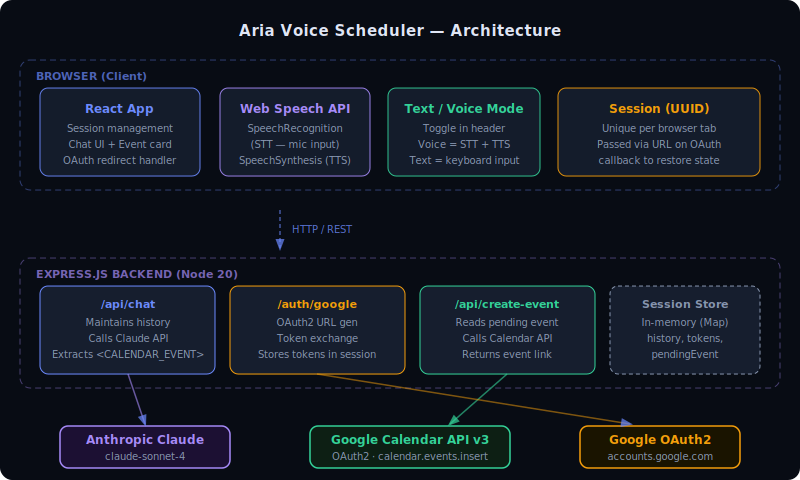

# 🎙 Aria — Voice Scheduling Agent

A real-time AI voice assistant that books Google Calendar events through natural conversation. Built with **Groq (Llama 3.3)**, **Deepgram STT**, and **Google Calendar API v3**.



---

## 🚀 Live Demo

**Deployed URL:** `[https://aria-voice-scheduler.vercel.app](https://aria-build.vercel.app/)` *(update after deployment)*

> **Quick test (no Google auth needed):** Set `REACT_APP_DEMO_MODE=true` in `frontend/.env` to skip OAuth and simulate event creation.

### How to Test
1. Open the URL in **Chrome** (required for Deepgram mic access)
2. Click **"Start Scheduling"**
3. Toggle **Text** or **Voice** mode (top-right)
4. In Voice mode: click 🎙 to start speaking, click ⬛ or wait 1 second of silence to send
5. Tell Aria your name, preferred date/time, and meeting title
6. When the event card appears, click **"Add to Google Calendar"**
7. Sign in with Google (one-time OAuth consent)
8. Event is created ✅ — appears in your Google Calendar immediately

### Example Conversation
```
Aria:  Hi! I'm Aria, your scheduling assistant. What's your name?
You:   I'm Sheheryar.
Aria:  Great to meet you! What date works for your meeting?
You:   Tomorrow.
Aria:  Perfect. What time would you prefer?
You:   8 PM.
Aria:  Got it! And what's the meeting about?
You:   Interview with Sherriar Faisal.
Aria:  To confirm: "Interview with Sherriar Faisal" on Monday March 23rd
       at 8:00 PM for 60 minutes. Shall I go ahead?
You:   Yes, go ahead.
→ [Event Card appears — Monday, March 23 at 8:00 PM]
→ [Click "Add to Google Calendar"]
→ [Google OAuth consent screen]
→ [Event created ✅ — appears in Google Calendar]
```

---

## 🏗 Architecture

```
┌──────────────────────────────────────────────────────────┐
│                    Browser (Chrome)                      │
│                                                          │
│  ┌─────────────┐  ┌──────────────────┐  ┌────────────┐  │
│  │  React App  │  │  Deepgram STT    │  │ Text/Voice │  │
│  │  (chat UI)  │  │  (WebSocket)     │  │   toggle   │  │
│  └─────────────┘  └──────────────────┘  └────────────┘  │
└─────────────────────────┬────────────────────────────────┘
                          │ HTTP REST (JSON)
┌─────────────────────────▼────────────────────────────────┐
│               Express.js Backend (Node 20)                │
│                                                          │
│  POST /api/chat           — conversation + event extract │
│  GET  /auth/google        — OAuth2 redirect              │
│  GET  /auth/google/callback — token exchange             │
│  POST /api/create-event   — real Google Calendar write   │
│  POST /api/create-event-demo — mock (demo mode)          │
│  GET  /health             — uptime check                 │
└──────────────┬──────────────────────┬────────────────────┘
               │                      │
    ┌──────────▼──────┐    ┌──────────▼──────────────┐
    │  Groq API       │    │  Google Calendar API v3  │
    │  Llama 3.3 70B  │    │  + Google OAuth2         │
    └─────────────────┘    └──────────────────────────┘
```

### Stack

| Layer | Technology | Cost |
|-------|-----------|------|
| **LLM** | Groq — Llama 3.3 70B | Free (~14,400 req/day) |
| **Voice Input (STT)** | Deepgram Nova-2 (WebSocket) | Free ($200 credit) |
| **Voice Output (TTS)** | Browser SpeechSynthesis API | Free |
| **Frontend** | React 18 | Free |
| **Backend** | Node.js 20 + Express 4 | Free |
| **Calendar** | Google Calendar API v3 | Free |
| **Auth** | Google OAuth2 | Free |
| **Hosting** | Railway (backend) + Vercel (frontend) | Free |

**Total cost: $0** — no credit card required for any service.

---

## 📅 Calendar Integration Explained

### Phase 1 — Structured Event Extraction
The LLM (Llama 3.3 via Groq) is instructed to emit a machine-readable block when the user confirms their booking:

```xml
<CALENDAR_EVENT>
{
  "title": "Interview with Sherriar Faisal",
  "date": "2026-03-23",
  "time": "20:00",
  "duration": 60,
  "confirmed": true
}
</CALENDAR_EVENT>
```

The backend extracts this with a regex, parses the JSON, stores it as `pendingEvent` in the session, and strips it from the spoken response shown to the user.

### Phase 2 — Google OAuth2 Authorization
When user clicks "Add to Google Calendar":
1. Frontend redirects to `GET /auth/google?sessionId=<uuid>`
2. Backend generates OAuth2 URL (scope: `calendar.events`)
3. User consents on Google's screen
4. Google redirects to `/auth/google/callback?code=...&state=<sessionId>`
5. Backend exchanges code for tokens, stores in session
6. Frontend redirected back with `?authed=true&sessionId=<uuid>`
7. Event creation proceeds automatically

### Phase 3 — Event Creation
```javascript
calendar.events.insert({
  calendarId: "primary",
  requestBody: {
    summary: title,
    start: { dateTime: startDateTime.toISOString() },
    end:   { dateTime: endDateTime.toISOString() },
  }
})
```
Returns `htmlLink` — a direct URL to the created event shown to the user.

---

## 🔑 Getting Your Free API Keys

### 1. Groq API Key (LLM) — free, no credit card
1. Go to **[console.groq.com](https://console.groq.com)**
2. Sign up with Google
3. Click **API Keys → Create API Key**
4. Copy the key (starts with `gsk_`)

### 2. Deepgram API Key (STT) — free $200 credit
1. Go to **[console.deepgram.com](https://console.deepgram.com)**
2. Sign up
3. Click **API Keys → Create a New API Key**
4. Copy the key

### 3. Google OAuth2 (Calendar) — free
1. Go to **[console.cloud.google.com](https://console.cloud.google.com)**
2. Create a new project
3. **APIs & Services → Library** → Enable **Google Calendar API**
4. **APIs & Services → Credentials → Create Credentials → OAuth 2.0 Client ID**
5. Application type: **Web application**
6. Add Authorized redirect URI:
   - Local: `http://localhost:3001/auth/google/callback`
   - Production: `https://your-backend.railway.app/auth/google/callback`
7. Copy **Client ID** and **Client Secret**
8. **APIs & Services → OAuth consent screen** → Add your email as a test user

---

## 💻 Running Locally

### Prerequisites
- Node.js 18+
- Chrome browser
- The 3 API keys above

### Step 1 — Backend
```cmd
cd backend
copy .env.example .env
```

Edit `backend/.env`:
```
GROQ_API_KEY=gsk_your_key_here
GOOGLE_CLIENT_ID=your_client_id_here
GOOGLE_CLIENT_SECRET=your_client_secret_here
GOOGLE_REDIRECT_URI=http://localhost:3001/auth/google/callback
FRONTEND_URL=http://localhost:3000
PORT=3001
```

```cmd
npm install
npm run dev
```
Backend runs on **http://localhost:3001**

### Step 2 — Frontend (new terminal)
```cmd
cd frontend
copy .env.example .env
```

Edit `frontend/.env`:
```
REACT_APP_API_URL=http://localhost:3001
REACT_APP_DEEPGRAM_API_KEY=your_deepgram_key_here
REACT_APP_DEMO_MODE=false
```

```cmd
npm install
npm start
```
Frontend runs on **http://localhost:3000**

### Demo Mode (skip Google OAuth)
Set `REACT_APP_DEMO_MODE=true` in `frontend/.env` — event creation is simulated, returns a pre-filled Google Calendar link. Good for testing without OAuth setup.

---

## 🚀 Deployment (Free)

### Step 1 — Deploy Backend to Railway

1. Push your code to GitHub:
```cmd
git init
git add .
git commit -m "Aria voice scheduler"
gh repo create aria-voice-scheduler --public --push
```

2. Go to **[railway.app](https://railway.app)** → New Project → Deploy from GitHub
3. Select your repo → select the `backend` folder as root
4. Add these environment variables in Railway dashboard:
```
GROQ_API_KEY=gsk_your_key
GOOGLE_CLIENT_ID=your_client_id
GOOGLE_CLIENT_SECRET=your_client_secret
GOOGLE_REDIRECT_URI=https://your-backend.railway.app/auth/google/callback
FRONTEND_URL=https://your-frontend.vercel.app
PORT=3001
```
5. Railway gives you a URL like `https://aria-xxx.railway.app` — copy it

### Step 2 — Add Production Redirect URI to Google Cloud
1. Go to Google Cloud Console → Credentials → your OAuth Client ID
2. Add to Authorized redirect URIs:
```
https://your-backend.railway.app/auth/google/callback
```
3. Save

### Step 3 — Deploy Frontend to Vercel

1. Go to **[vercel.com](https://vercel.com)** → New Project → Import your GitHub repo
2. Set **Root Directory** to `frontend`
3. Add environment variables:
```
REACT_APP_API_URL=https://your-backend.railway.app
REACT_APP_DEEPGRAM_API_KEY=your_deepgram_key
REACT_APP_DEMO_MODE=false
```
4. Click Deploy
5. Vercel gives you a URL like `https://aria-xxx.vercel.app`

### Step 4 — Update Railway FRONTEND_URL
Go back to Railway → update `FRONTEND_URL` to your Vercel URL → redeploy.

### Step 5 — Test it
Open your Vercel URL in Chrome → click Start Scheduling → everything should work end-to-end.

---

## 📋 Project Structure

```
aria-voice-scheduler/
├── package.json               ← root convenience scripts
├── docker-compose.yml
├── .gitignore
├── README.md
├── scripts/
│   ├── setup.sh               ← Linux/Mac setup
│   └── test-integration.js    ← API integration tests
├── docs/
│   └── architecture.svg
├── backend/
│   ├── server.js              ← Express + Groq + Google Calendar
│   ├── package.json           ← groq-sdk, googleapis, express
│   ├── Dockerfile
│   ├── Procfile               ← Railway: "web: node server.js"
│   ├── railway.json
│   └── .env.example
└── frontend/
    ├── src/
    │   ├── App.js             ← React + Deepgram STT + voice UI
    │   ├── App.css            ← Dark theme
    │   └── index.js
    ├── public/index.html
    ├── package.json
    ├── Dockerfile
    └── nginx.conf
```

---

## 🔑 Key Design Decisions

**Deepgram Nova-2 for STT**
Replaced the browser's built-in Web Speech API (which struggles with "8 PM", numbers, and names) with Deepgram's Nova-2 model over WebSocket. `smart_format=true` correctly handles times, dates, and proper nouns. Live interim transcript shown as user speaks.

**Groq for LLM**
Uses Llama 3.3 70B via Groq's LPU hardware — extremely fast (~300ms responses) with a generous free tier (~14,400 req/day). No quota issues during testing unlike Gemini's restrictive free tier.

**Structured AI output via XML tags**
The LLM wraps confirmed event JSON in `<CALENDAR_EVENT>` tags. This gives deterministic extraction — the backend regex-parses it reliably regardless of how the AI phrases the surrounding text.

**UUID session-per-tab**
Each browser tab gets a UUID on load. The sessionId travels in the OAuth `state` parameter so the backend re-attaches tokens to the correct session after Google redirects back.

**Progressive auth — OAuth deferred until needed**
Google OAuth is only triggered when the user clicks "Add to Google Calendar" — not at page load. This makes the conversation flow feel natural and reduces friction.

---

## 🧪 Known Limitations

- Voice input requires **Chrome** (Deepgram WebSocket uses MediaRecorder which has best support in Chrome)
- Sessions are in-memory — reset on server restart (use Redis for production persistence)
- Google OAuth tokens not encrypted at rest (fine for demo; use secret manager in production)
- Free tier Railway instances sleep after inactivity — first request may be slow (~5s cold start)

---

*Built for the AI Engineer take-home assignment — March 2026*


